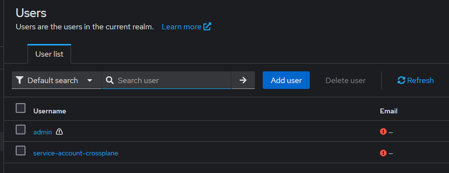
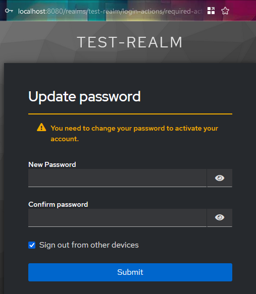

# Getting started

This guide will let you set up everything to try out crossplane-contrib/provider-keycloak on a fresh kind cluster.

## Prerequisites

[ctlptl](https://github.com/tilt-dev/ctlptl), [kind](https://kind.sigs.k8s.io/), [kubectl](https://kubernetes.io/docs/tasks/tools/#kubectl), [helm](https://helm.sh/docs/intro/install/)

This example is written with linux in mind, but it will work on Windows with PowerShell 7 as well.

## Keycloak up and running

This is an express installation of keycloak on new kind cluster.

``` sh
ctlptl apply -f kind-kustomize/cluster/cluster.yaml

kubectl apply -f kind-kustomize/keycloak/keycloak.yaml
kubectl wait --for=condition=Available deployment kc -n keycloak --timeout=180s
kubectl port-forward -n keycloak svc/keycloak 8080:80
```


```
❯ ctlptl apply -f kind-kustomize/cluster/cluster.yaml
No kind clusters found.
Creating cluster "provider-keycloak-cluster" ...
 ✓ Ensuring node image (kindest/node:v1.31.0) 🖼
 ✓ Preparing nodes 📦 📦
 ✓ Writing configuration 📜
 ✓ Starting control-plane 🕹️
 ✓ Installing CNI 🔌
 ✓ Installing StorageClass 💾
 ✓ Joining worker nodes 🚜
Set kubectl context to "kind-provider-keycloak-cluster"
You can now use your cluster with:

kubectl cluster-info --context kind-provider-keycloak-cluster

Have a question, bug, or feature request? Let us know! https://kind.sigs.k8s.io/#community 🙂
Switched to context "kind-provider-keycloak-cluster".
 🔌 Connected cluster kind-provider-keycloak-cluster to registry ctlptl-registry at localhost:52145
 👐 Push images to the cluster like 'docker push localhost:52145/alpine'
cluster.ctlptl.dev/kind-provider-keycloak-cluster created

```

```
> kubectl apply -f kind-kustomize/keycloak/keycloak.yaml
namespace/keycloak created
configmap/keycloak-cm created
service/keycloak created
deployment.apps/kc created

```

```
> kubectl wait --for=condition=Available deployment kc -n keycloak --timeout=180s
deployment.apps/kc condition met

> kubectl port-forward -n keycloak svc/keycloak 8080:80
Forwarding from 127.0.0.1:8080 -> 8080
Forwarding from [::1]:8080 -> 8080
Handling connection for 8080
```

When surfing into the keycloak UI at http://localhost:8080 you can logon as admin/admin. You are then prompted to replace the temporary admin account with a permanent one. For the purpose of demonstrating or getting started with this crossplane provider you can skip this step. Make sure the new user can log on and has the correct access (typically the admin role) before deleting the temporary user.


Refer to the keycloak documentation on how to best harden security for your setup of keycloak and consider using an external database. https://www.keycloak.org/docs/latest/server_admin/#proc-creating-user_server_administration_guide


## Installing crossplane

The procedure to install crossplane is described in better detail on the crossplane main repository, and on their webpage: https://docs.crossplane.io/latest/software/install/

Here is a minimal example to get up and running with everything you need.

``` sh
helm repo add crossplane-stable https://charts.crossplane.io/stable
helm repo update
helm install crossplane --namespace crossplane-system --create-namespace crossplane-stable/crossplane 

``` 

The following step will bootstrap a working client in the master realm with the admin role that crossplane will use in a future step. You should consider learning to set up a similar client through the UI or through the API in a manner which fits your security practices.

``` sh
# creates a config map with the script to run
kubectl create configmap client-script -n keycloak --from-file=kind-kustomize/crossplane/create-client.sh

# creates a job to run the script from within kubernetes.
kubectl apply -f kind-kustomize/crossplane/create-client.yaml

```

We can now create the keycloak crossplane provider and configure it to use the client withing the master realm to perform actions there.

The settings for the client will also make it appear as a service-account user in the realm.



``` sh
# deploys the keycloak provider
kubectl apply -f ./kind-kustomize/crossplane/provider.yaml
sleep 3
kubectl wait --for=condition=established crd providerconfigs.keycloak.crossplane.io --timeout=30s
kubectl apply -f ./kind-kustomize/crossplane/providerconfig.yaml
```

Finally we can try out using our keycloak crossplane provider, here is an example of creating a new realm.

``` sh
kubectl apply -f ./kind-kustomize/test-realm/realm.yaml
```

If we want to observe the new realm to be able to use data generated inside it we can leverage existing functions for the provider.

```
kubectl apply -f ./kind-kustomize/crossplane/keycloak-built-in-objects/xrd.yaml
kubectl apply -f ./kind-kustomize/crossplane/keycloak-built-in-objects/composition.yaml
kubectl apply -f ./kind-kustomize/crossplane/keycloak-built-in-objects/functions.yaml
# written specifically for the test-realm
kubectl apply -f ./kind-kustomize/crossplane/keycloak-built-in-objects/xr-test-realm.yaml
```

Once synced the observable default items will all be available through kube-api.

``` sh
kubectl get roles.role.keycloak.crossplane.io
```

This will then allow us to reference them in crossplane like in the example below that creates a user in the new role and assigns them the administrative role. The format is `builtin-<realm-name>-<client-name>-<client-role-name>`. Thus for role *realm-admin* in the realm *test-realm* which is a client role for the client *realm-management* the name would be `builtin-test-realm-realm-management-realm-admin` :)

``` sh
kubectl apply -f ./kind-kustomize/test-realm/admin-user.yaml
```

Once this has synched, you can surf to the security admin console of the test-realm, sign in with testadmin/testadmin and you will be prompted to update your temporary password for the user testadmin.

http://localhost:8080/admin/test-realm/console/



## clean up

To delete the cluster you created with ctlptl, run the following.

``` sh
ctlptl delete -f kind-kustomize/cluster/cluster.yaml
```